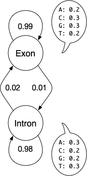
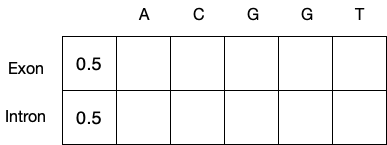
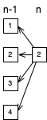
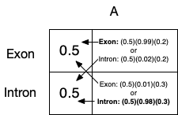
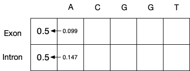

Viterbi Challenge
=================

A programming challenge for fun! Everyone should program the Viterbi
algorithm at least once in their life. It's a great illustration of the
trade-offs required in algorithm design and biological modeling.

## Background ##

One of the best books on bioinformatics algorithms is "Biological
Sequence Analysis: Probabilistic Models of Proteins and Nucleic Acids"
by Durbin, Eddy, Krogh, and Mitchison. If you want a textbook
description of HMMs in biology, this is the gold standard. However, you
will not need the text for this problem.

## Toy Problem ##

We are going to build the world's simplest gene finder. It has 2 states:
a GC-rich exon and AT-rich intron.

The transition probabilities are listed in the table below. These
represent plausible values, not actual values. Should you want to train
your HMM with actual values, see the Training section below.

|  From  |    To  | Prob |
|:------:|:------:|:----:|
| exon   | exon   | 0.99 |
| exon   | intron | 0.01 |
| intron | intron | 0.98 |
| intron | exon   | 0.02 |

Exons are GT-rich and introns are AT-rich. The following table gives
some plausible values. Should you want to train your HMM with actual
values, see the Training section below.

|  State |  A  |  C  |  G  |  T  |
|:------:|:---:|:---:|:---:|:---:|
| exon   | 0.2 | 0.3 | 0.3 | 0.2 |
| intron | 0.3 | 0.2 | 0.2 | 0.3 |

## Viterbi Description ##

The Viterbi algorithm has 3 stages.

1. Initialization
2. Fill
3. Traceback

## Viterbi Initialization ##

Before you start the Viterbi algorithm, you will have to create a matrix
to store your probabilities and traceback pointers. You can have a
single matrix of tuples or two separate matrices, one for probabilities
and one for traces.

The initialization stage is pretty trivial. It simply sets the first
column to some initial value. You can choose 50% for each state if you
have no idea if exons or introns are more common. However, if you knew
that there was twice as much exon than intron, you would set exon to 67%
and intron to 33%. If you have many states, the sum of all initial
probabilities must be 1.0.

After allocating your matrix and setting the initial values, you will
have something that looks conceptually like this:

## Viterbi Fill ##

The fill is a repetitive action. At every cell in the matrix, you find
the maximum path to that point. Since this is somewhat boring for 2
states, let's temporarily imagine a 4-state HMM. Given a point in the
sequence n and state 2, the diagram below shows the possible paths.

Each path has some probability which contains 3 parts. For example,
let's say we want to calculate the probability of the path from
"position n-1, state 1" to "position n, state 2". The 3 parts are as
follows:

1. The probability in cell position n-1, state 1
2. The transition probability from state 1 to state 2
3. The emission probability of whatever letter is at n from state 2

At the beginning of the fill, the only place you can start filling the
matrix is in the second column. Once those values are filled, you can
start calculating the 3rd column. You can see why the initialization was
import: it created a place to start.

Now let's get back to our 2-state exon-intron HMM. After initialization,
you can start the fill for the 2nd column. For the exon state, you have
2 possibilities: the previous position in the exon or intron state. You
also have these 2 choices for the intron.

After choosing the maximum, record the probability and which state was
on the maximum path.

Now you're ready for the next column. Keep repeating the procedure until
done.

## Viterbi Traceback ##

After the score and trace values are completely filled, you need to find
the maximum score in the final column. This is where you track back
from. Follow the states backward through the matrix until you get to the
first column. The path of states you followed is the state sequence.
This tells you which positions were exon vs. intron. Since you traced
backwards, it's in reverse order compared to the sequence.

## Evaluation ##

One way to evaluate the performance of your HMM's Viterbi algorithm is
to compare it to the training data. All of the nucleotides in exons
should be classified as exons, for example. This is such a simple HMM
that you can't expect much accuracy.

The next step is to mix a few introns and exons together to see if your
program can predict which parts are exon and which parts are intron.

When you're ready to unleash your program on a real genomic sequence,
try the `worm.fa` file. The coordinates of the exons are given in the
`worm.txt` file.

## Subtleties ##

If you use probabilities, you will underflow floating point numeric
precision as sequences get longer. For this reason, most Viterbi
algorithms are coded in log-space. In other words, convert all
probabilities to log probabilities and add rather than multiply.

The genomic file may contain characters that aren't in your training
set. Deal with them.

## Training ##

The file called `exons.fa` contains sequences of exons. Similarly, the
`introns.fa` file contains intron sequences. These all come from the C.
elegans genome. To obtain actual values for the various nucleotides,
determine the frequencies of each letter in each state of sequence.

In order to train the transition probabilities, find the average length
of exons and introns. If that value is 100, then the probability of
leaving the exon state is the reciprocal, or 0.01 (as shown above). The
probability of staying in the state is then 1 - the exit probability.

